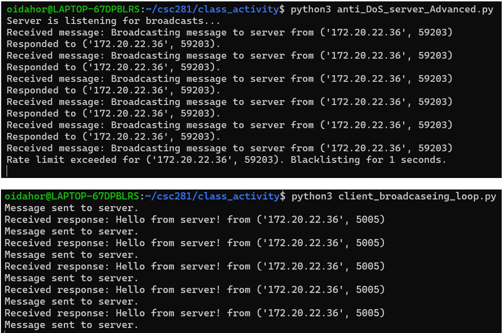
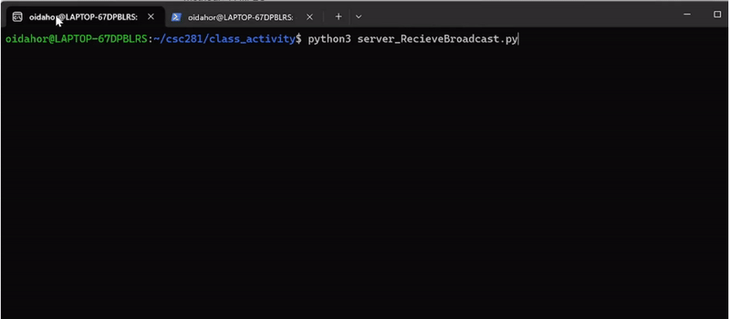
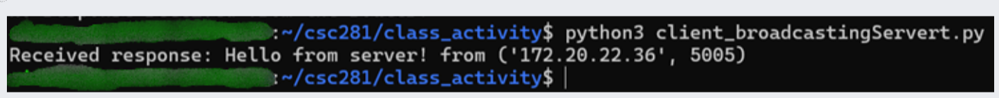
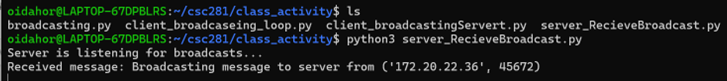

# Broadcasting and DoS Mitigation

## Overview

This project was developed as part of a hands-on lab for *Introduction to Cryptography and Computer Security - Fall 2024*. It demonstrates:
- Client-server communication using UDP.
- Broadcasting messages from the client to the server.
- Implementation of DoS (Denial of Service) mitigation strategies.

This lab provided an opportunity to apply networking principles in a practical setting, showcasing skills in socket programming, multithreading, and DoS mitigation techniques.

---

## Features

- **Broadcasting**: Clients broadcast UDP messages to a server.
- **Server Response**: The server listens for these broadcasts and responds to clients.
- **Anti-DoS Strategies**:
  - Rate-limiting requests per client.
  - Blacklisting abusive clients.
  - Multithreaded request handling for scalability.

---

## Screenshots and Results

### 1. Server Blacklisting Implementation
This screenshot demonstrates the server blacklisting a client for exceeding the request limit.



---

### 2. Broadcasting Loop in Action
Here’s the output from a client broadcasting continuously to the server.



---

### 3. Client Broadcasting Results
This shows the results of a successful client broadcast.



---

### 4. Server Listening for Broadcasts
The server captures and processes client broadcasts effectively.



---

## How to Run

1. Clone the repository:
   ```bash
   git clone https://github.com/junior91185/broadcasting-and-DoS-mitigation.git
   cd broadcasting-and-DoS-mitigation
   python3 code/server_ReceiveBroadcast.py
   python3 code/client_broadcasting_loop.py

